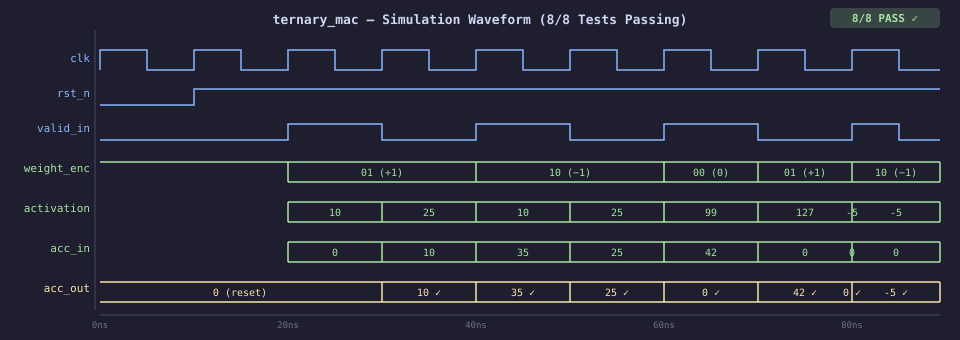

# TernaryCore

**An open-source FPGA accelerator for BitNet ternary neural network inference.**

BitNet b1.58 encodes every model weight as {-1, 0, +1}. That collapses matrix multiplication — the core operation of every transformer layer — into additions, subtractions, and conditional skips. No multiplies. TernaryCore is hardware built to match that arithmetic natively.

[](https://ohwr.org/cern_ohl_s_v2.txt)
[]()

---

## Simulation Status

| Module | Tests | Status |
|--------|-------|--------|
| `ternary_mac` | 8/8 | ✅ All passing |
| `ternary_dot` | 7/7 | ✅ All passing |
| `ternary_gemm` | 16/16 (4×4) | ✅ All passing |

---

## Waveform

`ternary_mac` simulation — all 8 test vectors verified in Icarus Verilog:



`acc_out` updates exactly one clock after each `valid_in` pulse. Sign extension and two's-complement negation are handled in RTL with no DSP blocks — adders and mux logic only.

---

## Architecture

```
activation (int8) ──┐
                    ├── ternary_mac ──┐
weight_enc (2-bit) ─┘                │
                                     ├─ × VECTOR_LEN ──► ternary_dot ──┐
                                     │                                  │
                                                                        ├─ × COLS ──► ternary_gemm
```

Three layers, each building on the last:

**`ternary_mac`** — the atomic cell. Takes one activation, one 2-bit weight, and a running accumulator. Outputs `acc_in ± activation` or `acc_in` (zero weight), registered on the clock edge. No multiplier.

**`ternary_dot`** — streaming dot product over `VECTOR_LEN` elements (default 64). Resets automatically between vectors; asserts `valid_out` for one cycle when the result is ready.

**`ternary_gemm`** — matrix multiply using `COLS` parallel `ternary_dot` instances. One activation is broadcast per cycle to all column dots, each receiving its own weight encoding. Produces one output row every `DEPTH` cycles.

### Weight Encoding

| `weight_enc` | Ternary value | Operation |
|---|---|---|
| `2'b00` | 0 | No contribution (skip) |
| `2'b01` | +1 | `acc_out = acc_in + activation` |
| `2'b10` | -1 | `acc_out = acc_in - activation` |

---

## Getting Started

**Prerequisites:** [Icarus Verilog](https://steveicarus.github.io/iverilog/) (`brew install icarus-verilog` on macOS), Python 3.

```bash
git clone https://github.com/shepherdscientific/ternarycore.git
cd ternarycore/sim
```

### Run simulations

```bash
make tb_ternary_mac    # ternary_mac — 8 tests
make tb_ternary_dot    # ternary_dot — 7 tests (VLEN=8)
make tb_ternary_gemm   # ternary_gemm — 4×4 matrix multiply
make all               # run all three
```

### Cross-verify with Python

```bash
make verify
# or individually:
python3 verify/verify_mac.py
python3 verify/verify_dot.py
python3 verify/verify_gemm.py
```

### View waveforms

Open any `.vcd` file in VSCode with the [WaveTrace](https://marketplace.visualstudio.com/items?itemName=wavetrace.wavetrace) extension. Useful signals to add: `clk`, `rst_n`, `valid_in`, `activation`, `weight_enc`, `acc_in`, `acc_out`.

---

## Repository Layout

```
ternarycore/
├── rtl/
│   ├── ternary_mac.v       # single MAC cell
│   ├── ternary_dot.v       # streaming dot product
│   └── ternary_gemm.v      # matrix multiply
├── tb/
│   ├── tb_ternary_mac.v
│   ├── tb_ternary_dot.v
│   └── tb_ternary_gemm.v
├── sim/
│   ├── Makefile
│   └── verify/
│       ├── verify_mac.py
│       ├── verify_dot.py
│       └── verify_gemm.py
├── docs/
│   └── waveform_mac.svg
└── LICENSE                 # CERN-OHL-S v2 (RTL) + MIT (scripts)
```

---

## Roadmap

- [x] `ternary_mac` — single cell, all tests passing
- [x] `ternary_dot` — 64-element vector dot product
- [x] `ternary_gemm` — 4×4 matrix multiply
- [ ] Deploy to Xilinx Artix A7 (Arty A7-100T)
- [ ] `ternary_dot` at 64-element depth on real silicon
- [ ] Timing closure and resource utilisation report
- [ ] Head-to-head benchmark: tokens/sec and W vs CPU/GPU baseline
- [ ] Full transformer layer pipeline

---

## License

RTL source files (`rtl/`, `tb/`) are licensed under the **CERN Open Hardware Licence v2 — Strongly Reciprocal (CERN-OHL-S v2)**. Derivative hardware designs must remain open under the same terms.

Software tools and verification scripts (`sim/verify/*.py`) are licensed under the **MIT License**.

See [LICENSE](LICENSE) for full terms.

---

## Related Work

- Benchmark repo (KV cache / local LLM inference): [github.com/shepherdscientific/llama-server-tuning](https://github.com/shepherdscientific/llama-server-tuning)
- BitNet b1.58: [arxiv.org/abs/2402.17764](https://arxiv.org/abs/2402.17764)
- CERN-OHL-S v2: [ohwr.org/cern_ohl_s_v2.txt](https://ohwr.org/cern_ohl_s_v2.txt)
