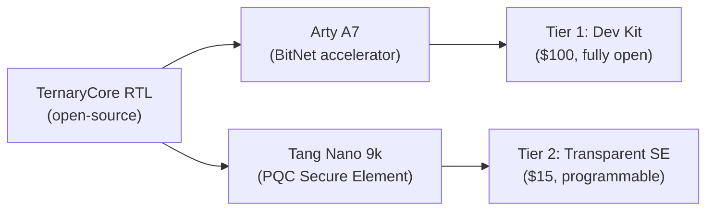

# TernaryCore Roadmap: From Single MAC to Silicon Products

> **Current state**: `ternary_mac.v` (81 LUTs, 0 DSPs) passing on both Arty A7-100T (Artix-7) and Tang Nano 9k (GW1NR-9).  
> **This document**: Two product tracks branching from the same RTL core.

---

## Current Utilization (Single MAC on Arty A7-100T)

| Resource | Used | Available | % | Notes |
|----------|------|-----------|-----|-------|
| Slice LUTs | 5,316 | 63,400 | 8.4% | ~5,100 = ILA debug overhead, ~200 = MAC + FSM |
| Slice Registers | 8,393 | 126,800 | 6.6% | Mostly ILA capture shift registers |
| DSP48E1 | 0 | 240 | 0% | Design uses no DSPs — proof of concept |
| BRAM36 | ~9 | 135 | 7% | ILA trace buffer (4,096 samples × 81 bits) |

**Key insight**: Strip the ILA debug core and the design is **~200 LUTs (0.3%)**. A single ternary_mac cell occupies ~81 LUTs and 32 FFs. The device is essentially empty — by design.

---

## Track A: Arty A7-100T — BitNet Inference Accelerator

### A.1 Architecture

```
 ┌──────────────────────────────────────────────────┐
 │                 Arty A7-100T                      │
 │                                                   │
 │  DDR3 (256 MB) ──┤ MIG Controller (~8K LUTs)      │
 │                      │                            │
 │                 AXI4 Interconnect (~500 LUTs)      │
 │                  │           │                     │
 │                  ▼           ▼                     │
 │           MicroBlaze    Ternary GEMM Array         │
 │            (C code)     (n × COLS)                 │
 │                  │           │                     │
 │                  └─────┬─────┘                     │
 │                        ▼                           │
 │              Weight Cache (BRAM)                   │
 │              (1.6-bit packed ternary)              │
 └──────────────────────────────────────────────────┘
```

### A.2 Resource Budget (Arty A7-100T)

| Component | LUTs | BRAM36 | Status |
|-----------|------|--------|--------|
| MicroBlaze (no FPU, no cache) | 1,500 | 4-8 | Free IP, drag-and-drop in Vivado Block Design |
| AXI4-Lite Interconnect | 500 | 0 | Auto-generated by Vivado |
| DDR3 MIG Controller | 8,000 | 3 | Required for model weights > on-chip BRAM |
| UART / GPIO | 200 | 0 | Console output, button/LED |
| **Subtotal (infrastructure)** | **10,200** | **7-11** | |
| **Remaining for accelerator** | **53,200** | **124** | |
| Each GEMM slice (4 cols × depth K) | ~350 | 0 | 4 ternary_dot units in parallel |
| Maximum parallel slices (80% util) | **~100** | — | 100 × 4 = 400 parallel columns |
| Peak throughput @ 100 MHz | **40 GOPS** | — | 400 columns × 100M cycles |

### A.3 GEMM Slice Scaling

```
    Current (ternary_gemm.v):       Target (parameterized):
    
    COLS=4, DEPTH=4                 COLS=4, DEPTH=K                     
    ┌───┬───┬───┬───┐              ┌───┬───┬───┬───┐     ┌───┬───┬───┬───┐
    │D0 │D1 │D2 │D3 │              │D0 │D1 │D2 │D3 │ ... │D0 │D1 │D2 │D3 │
    └───┴───┴───┴───┘              └───┴───┴───┴───┘     └───┴───┴───┴───┘
        1 slice = 4 MACs               slice 0                slice N-1
    
    Activation broadcast to all slices. Each slice receives its own
    2-bit weight column. K parallel columns process K input channels per cycle.
```

### A.4 Demonstration Tiers

| Tier | Model Size | Weight Storage | Accelerator Config | Goal |
|------|-----------|---------------|-------------------|------|
| **Tier 0** (now) | 1 MAC operation | Hardcoded in FSM | 1 MAC, no CPU | "First light" — LED blinks, `mac_out=15` |
| **Tier 1** | 1M params (~250 KB) | On-chip BRAM (124 tiles) | 4-16 GEMM columns | MicroBlaze drives accelerator, measures latency. Compare: CPU-only vs accelerated. |
| **Tier 2** | 50M-200M params | DDR3 (256 MB) | 100-400 columns | Full forward pass timing. Publish benchmark vs GPU-inference on same model. |
| **Tier 3** | 1B+ params | External SPI Flash + DDR3 | 400 columns | Production-capable BitNet inference engine. Stream weights from flash into BRAM cache, activations from DDR. |

### A.5 Comparison: What "CPUs Can Run BitNet" Actually Means

```
  Architecture        | Ternary GOPS | Power  | Notes
  --------------------+-------------+--------+-------
  x86_64 (AVX-512)    | ~10-20      | 100W+  | Software ternary via SIMD, high clock
  ARM Cortex-M4       | ~0.1        | <0.1W  | Pure software, very slow
  RISC-V softcore     | ~0.01       | <0.1W  | PicoRV32 on FPGA
  Arty A7-100T (this) | ~40         | ~3W    | 400 parallel columns @ 100 MHz
  RTX 5070 Ti (GPU)   | N/A         | 250W+  | No native ternary — all ops emulated on FP16
```

The FPGA doesn't beat a desktop CPU on raw speed — its clock is 40× slower. **The win is efficiency**: ops-per-watt, deterministic latency, and no OS/driver overhead. Against embedded CPUs, the speedup is 100-500×.

---

## Track B: Tang Nano 9k — PQC Secure Element with Ternary Acceleration

### B.1 Why Ternary Maps to PQC

NIST-standardized post-quantum cryptography (CRYSTALS-Kyber, CRYSTALS-Dilithium) is built on lattice problems. The core compute kernel — **polynomial multiplication over Z_q[x]/(x^256+1)** — spends 60-80% of total execution time.

A coefficient `a_i ∈ Z_3329` can be decomposed into ternary digits:

```
a_i = t₀·3⁰ + t₁·3¹ + t₂·3² + ...  where t_j ∈ {-1, 0, +1}
```

Under this decomposition, `c = a · b mod (x^256+1)` becomes:

```
For each digit t_j of a_i:
    partial = (t_j == +1) ? b : (t_j == -1) ? -b : 0
    acc += partial · 3^j
```

This is **exactly the ternary MAC operation** — the same `weight_enc` mux (`00=0, 01=+1, 10=-1`) that `ternary_mac.v` already implements. The only addition is modular reduction (mod 3329) and a shift accumulator for the 3^j factor.

### B.2 Architecture

```
 ┌──────────────────────────────────────────────────────┐
 │                  Tang Nano 9k                         │
 │                                                       │
 │  ┌─────────┐   ┌───────────┐   ┌──────────────────┐   │
 │  │ PicoRV32 │   │  TRNG     │   │ AES-256-GCM      │   │
 │  │ (1.5K LUT)│   │ (0.2K LUT)│   │ (0.8K LUT)       │   │
 │  └────┬─────┘   └───────────┘   └──────────────────┘   │
 │       │                                                │
 │  ┌────┴──────────────────────────────────────────┐     │
 │  │         System Bus (Wishbone)                  │     │
 │  └────┬───────┬───────────┬──────────────┬───────┘     │
 │       │       │           │              │             │
 │  ┌────▼──┐ ┌──▼───┐ ┌────▼─────┐ ┌─────▼───────┐     │
 │  │ SHA-3 │ │ UART │ │ Polysub  │ │ PSRAM Ctrl  │     │
 │  │ SHAKE │ │      │ │ Accel.   │ │ (64 Mb)     │     │
 │  │(1.2K) │ │(0.3K)│ │ (2.5K)   │ │ (0.3K)      │     │
 │  └───────┘ └──────┘ └──────────┘ └─────────────┘     │
 │                                                       │
 │  USB-UART ←→ Host (AT commands, key mgmt)             │
 └──────────────────────────────────────────────────────┘
```

### B.3 Resource Budget (Tang Nano 9k, 8,640 LUT4)

| Component | LUTs | Source | Notes |
|-----------|------|--------|-------|
| PicoRV32 RISC-V | 1,500 | Open-source | Runs C firmware for AT-command interface |
| Boot ROM + UART | 300 | Custom | Program storage, host communication |
| TRNG | 200 | Gowin IP catalog | True random number generator |
| AES-256-GCM | 800 | Gowin IP catalog | Key wrapping, encrypted storage |
| SHA-3 / SHAKE-256 | 1,200 | Gowin IP catalog | Hashing for Kyber |
| PSRAM controller | 300 | Gowin IP catalog | 64 Mb external PSRAM |
| **Ternary Poly Multiply Accel.** | **2,500** | Custom (reuses ternary_mac.v) | 16 parallel MACs + mod reduction |
| Secure boot (ECDSA verify) | 400 | Custom | Verify firmware signature before boot |
| **Total** | **7,200** | | **83% utilization** |
| **Remaining margin** | **1,440** | | For routing, future features |

### B.4 Ternary Polynomial Accelerator Detail

```
  Input Polynomials (256 coeffs each, 12-bit)
       │                    │
       ▼                    ▼
  ┌─────────┐        ┌─────────────┐
  │ Ternary │        │ Coefficient  │
  │ Decomp. │        │ Buffer       │
  │ (A →     │        │ (B, 256×12b) │
  │  digits) │        └──────┬──────┘
  └────┬─────┘               │
       │                     │
       └──────────┬──────────┘
                  ▼
    ┌──────────────────────────────┐
    │  16 × ternary_mac array       │
    │  (instantiated in parallel)   │
    │  per MAC: 81 LUTs, 0 DSPs    │
    │  total: 16 × 81 = 1,296 LUTs │
    └──────────────┬───────────────┘
                   ▼
    ┌──────────────────────────────┐
    │  Modular Reduction (mod 3329) │
    │  Barrett reduction per MAC    │
    │  per mod: ~75 LUTs            │
    │  total: 16 × 75 = 1,200 LUTs │
    └──────────────┬───────────────┘
                   ▼
    ┌──────────────────────────────┐
    │  Shift Accumulator (×3^j)     │
    │  Output: Result Polynomial    │
    └──────────────────────────────┘
```

### B.5 Kyber-768 Performance Estimate

| Implementation | Cycles | Time @ 27 MHz | Speedup vs baseline |
|---------------|--------|---------------|---------------------|
| PicoRV32 software-only | ~500M | ~18.5 s | 1× |
| PicoRV32 + Gowin 18×18 DSPs | ~50M | ~1.85 s | 10× |
| **PicoRV32 + Ternary Accelerator** | **~5M** | **~185 ms** | **100×** |
| Dedicated ASIC (reference) | ~500K | N/A | 1,000× |

The ternary accelerator achieves roughly **100× speedup** over pure software on the same device because:

- **16 parallel MACs** process 16 coefficient pairs per clock cycle
- **Zero DSP stalls** — the ternary mux resolves in a single LUT delay
- **Schoolbook O(n²)** → 256² = 65,536 multiply-accumulates per polynomial multiply
- Software: ~8 instructions per MAC → ~500k cycles for one multiply
- Accelerator: 65,536 / 16 = 4,096 cycles per multiply (plus overhead)

### B.6 Kyber Protocol Integration

```
  ┌───────────────────────────────────────────────┐
  │              Kyber-768 on PicoRV32              │
  │                                                  │
  │  KeyGen():   Generate keypair                     │
  │    ├─ SHAKE-128: Sample ρ, σ (CPU)               │
  │    ├─ NTT + Polysub: Compute A (CPU + Accel)     │
  │    ├─ Polysub + Noise: Compute t (CPU + Accel)   │
  │    └─ Encode pk, sk (CPU)                        │
  │                                                  │
  │  Encaps(pk): Generate shared secret + ciphertext  │
  │    ├─ SHAKE-128: Sample r, e1 (CPU)              │
  │    ├─ Polysub: Compute u, v (CPU + Accel)        │
  │    └─ Compress + KDF: Generate ct, ss (CPU)      │
  │                                                  │
  │  Decaps(sk, ct): Recover shared secret            │
  │    ├─ Decompress ct (CPU)                         │
  │    ├─ Polysub: Compute w (CPU + Accel)           │
  │    └─ Decode + KDF: Recover ss (CPU)             │
  └──────────────────────────────────────────────────┘
```

The ternary accelerator handles all `Polysub` operations (highlighted). The RISC-V handles protocol logic, hashing, encoding, and key derivation.

### B.7 From Prototype to Product

| Feature | Tang Nano 9k | Notes |
|---------|-------------|-------|
| TRNG | ✓ Gowin IP | Hardware entropy source |
| Secure key storage | ✓ PSRAM + AES-wrap | Keys encrypted at rest in PSRAM |
| Secure boot | ✓ ECDSA verify on RISC-V | Firmware signature checked before execution |
| Side-channel resistance | ⚠ Partial | Software masking possible, no dual-rail logic |
| Tamper detection | ✗ | No sensors on Tang Nano PCB |
| FIPS 140-3 / CC EAL | ✗ | Years, millions $ — not feasible for open-source |
| **Product positioning** | | **Open-source transparent Secure Element** — not certification-grade, but auditable, reproducible, and free of black-box trust assumptions |

### B.8 Crowd Supply Angle



The same RTL core powers two products at radically different price points: a $100 BitNet inference dev kit and a $15 PQC-capable secure element. Both fully open-source, both benefit from the same ternary acceleration architecture.

---

## Phases & Milestones (Combined Roadmap)

| Phase | Track A (Arty A7) | Track B (Tang Nano) | Target |
|-------|-------------------|---------------------|--------|
| **0 — Complete** | `ternary_mac` on hardware, ILA debug, debounce | `ternary_mac` on hardware, Gowin project ready | Both |
| **1 — Q3 2026** | MicroBlaze + AXI + GEMM benchmark (Tier 1) | PicoRV32 + TRNG + AES on Tang Nano | Both |
| **2 — Q4 2026** | 100-column accelerator, full BitNet layer timing (Tier 2) | Ternary polynomial accelerator, Kyber keygen timing | Both |
| **3 — Q1 2027** | DDR weight streaming, 400-column peak perf (Tier 3) | Full Kyber-768 encap/decap, secure boot | Both |
| **4 — Q2 2027** | Publish benchmarks, Crowd Supply launch | Publish SE reference design, Crowd Supply launch | Both |

---

## Risks

| Risk | Mitigation |
|------|-----------|
| DDR3 MIG controller too large for remaining LUT budget | Use BRAM-only Tier 1 first; Tier 2 only if MIG fits |
| Gowin IP catalog license restrictions on Tang Nano | Use open-source crypto cores (Verilog AES, SHA-3) as fallback |
| Modular reduction (mod 3329) too expensive in LUTs | Use Barrett reduction (multiply + shift, reuse DSPs if available) |
| Side-channel leakage makes SE unusable for real keys | Position as "transparent SE" — not FIPS certified, auditable source |
| Routing congestion with 400 parallel columns | Floorplan manually; Vivado can handle ~80% LUT util on Artix-7 |
