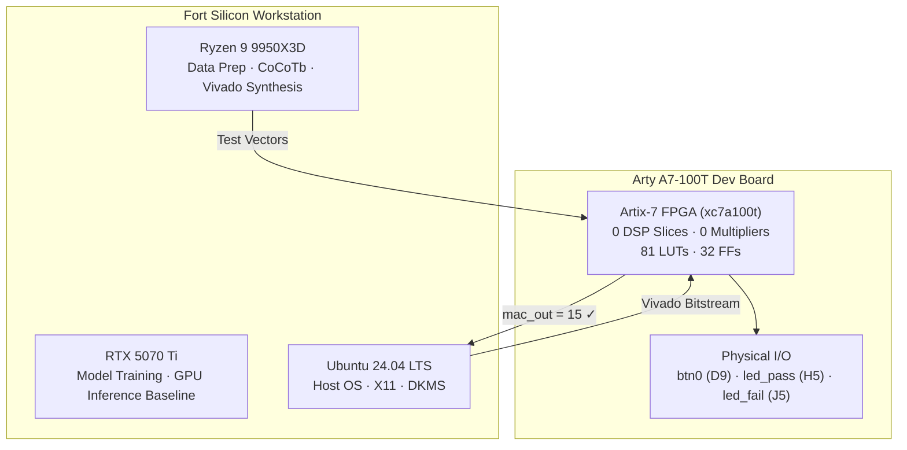
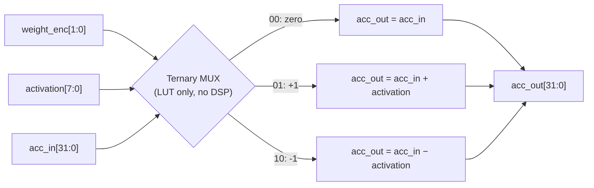
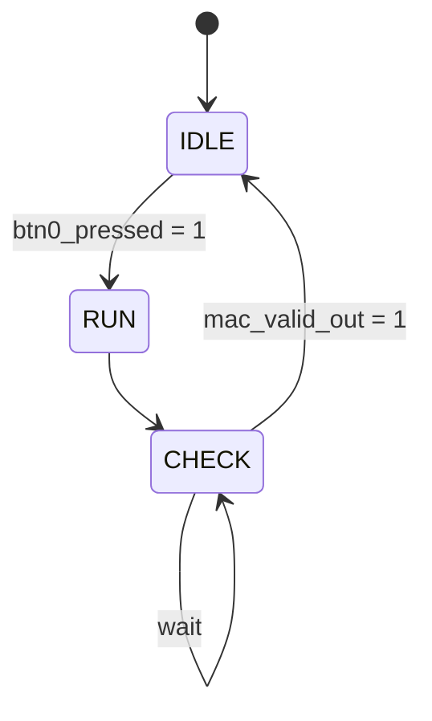
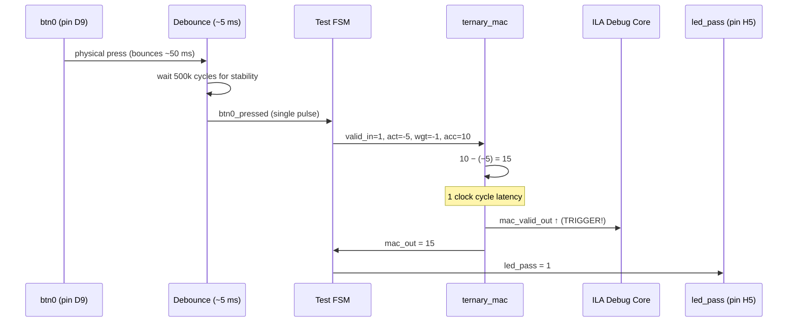
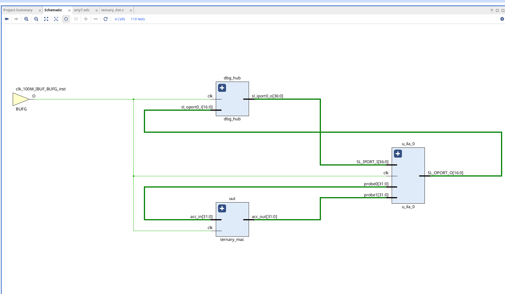
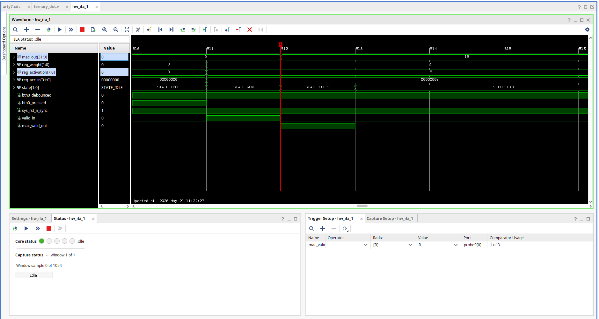
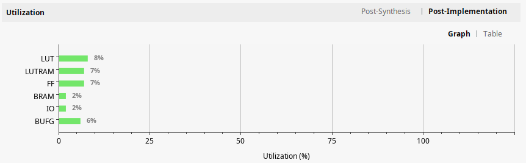
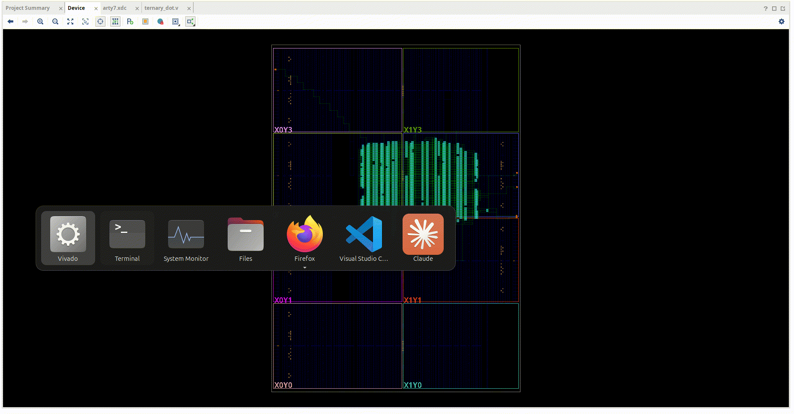

# The Physics of Compute: Why I Built "Fort Silicon" to Destroy the GPU Tax

We are living through a bizarre paradox in the evolution of artificial intelligence. On the software side, algorithmic breakthroughs are desperately trying to make intelligence lightweight, efficient, and localized. On the hardware side, we are still throwing brute-force, mega-watt silicon at the problem, treating every single AI calculation like a multi-million-dollar graphics rendering job.

The industry is slamming hard into two physical barriers: **The Memory Wall** and **The Compute Wall**.

To break through them, changing the software isn't enough. We have to change how silicon physically thinks. This is the engineering journey of **TernaryCore** — from setting up a raw bare-metal workstation, to building custom RTL that eliminates hardware multipliers entirely, to proving the math on real FPGA silicon ahead of an upcoming Crowd Supply launch.

---

## 1. The Core Contradiction: GPUs vs. 1-Bit LLMs

The mathematical foundation of modern AI relies on dense floating-point matrix multiplication ($\text{FP16}$ or $\text{BF16}$). To run these models, you need thousands of specialized, power-hungry Digital Signal Processing (DSP) blocks and Tensor Cores.

But architectures like **BitNet b1.58** proved that you can restrict LLM weights to just three discrete states — $\{-1, 0, +1\}$ — while retaining near-lossless accuracy compared to full-precision baselines.

When your weight set is limited to $W = \{-1, 0, +1\}$, the fundamental physics of compute changes:

* You no longer need floating-point multipliers.
* A multiplication operation completely collapses into a simple bit-shift or a sign-flip.

This brings us to a massive hardware paradox. To develop TernaryCore, I built a state-of-the-art workstation code-named **Fort Silicon** — anchored by an AMD Ryzen 9 9950X3D CPU and an NVIDIA RTX 5070 Ti.



This workstation is a powerhouse for training and preprocessing, but using a high-end desktop GPU to *execute* a ternary model at runtime is incredibly inefficient. Running a 1-bit model on an architecture designed for massive floating-point arithmetic is like using a space shuttle to deliver groceries.

Furthermore, commodity hardware enforces strict byte-alignment. Traditional chips cannot easily handle 1.58-bit states, so they pad ternary numbers into standard 2-bit integers ($\text{INT2}$). This introduces an immediate **25% memory storage penalty** over the theoretical minimum.

To genuinely exploit the efficiency of 1-bit architectures, we have to move away from fixed-silicon processors entirely. We have to build native ternary logic directly onto FPGAs.

---

## 2. Setting Up the Fortress: The Gritty Reality of Bare Metal

Before compiling a single line of Verilog, I had to ensure the host development environment on Fort Silicon was rock solid. Modern Linux environments have become highly protective, and configuring a heterogeneous compute workstation (mixing cutting-edge NVIDIA GPUs with Xilinx/AMD FPGA tools) means wrestling with the operating system kernel itself.

Staying on **Ubuntu 24.04 LTS** was a deliberate choice. While newer distributions have entirely deprecated legacy X11 sessions in favor of Wayland, classical FPGA synthesis tools like Xilinx Vivado still rely on X11 structures to render their block design interfaces smoothly.

Getting the RTX 5070 Ti online required navigating the modern Linux security infrastructure. Under strict Secure Boot parameters, the Linux kernel refuses to load third-party drivers unless they are explicitly authorized via a Machine Owner Key (MOK) handshake. Forcing the kernel to build the driver modules using DKMS headers, configuring the local package manager to fetch the `nvidia-container-toolkit` from isolated repositories, and managing Python environments through modern PEP 668 constraints were the hidden, unglamorous prerequisites to getting the workstation stable.

With the host system running smoothly, Python dependencies isolated safely via `uv` virtual environments, and the GPU fully initialized, the real architectural work could begin.

---

## 3. The TernaryCore Architecture: Silicon Without Multipliers

The core philosophy of the TernaryCore RTL is absolute minimalism. The repository contains pure hardware descriptions designed to map cleanly onto low-power, commodity programmable logic, such as the Artix-7 chip found on the Digilent Arty A7-100T dev board.

Inside the matrix multiplication engine (`ternary_gemm.v`), the hardware-heavy floating-point multipliers are completely replaced by basic multiplexer logic and adders. When calculating a streaming Multiply-Accumulate (MAC) operation, the hardware simply evaluates the ternary weight:

$$\text{Output} = \begin{cases} \text{Accumulator} + \text{Activation}, & \text{if } W = +1 \\ \text{Accumulator} - \text{Activation}, & \text{if } W = -1 \\ \text{Accumulator}, & \text{if } W = 0 \end{cases}$$



Because this structure uses only raw Lookup Tables (LUTs) and basic registers, the FPGA can execute thousands of these operations simultaneously without incurring the power draw or generating the heat of traditional computing units.

To solve the 2-bit storage waste issue, TernaryCore implements a custom native decompression module directly in the silicon fabric. Instead of mapping a ternary value to an inefficient 2-bit slot, the hardware packs exactly 5 ternary weights into a single 8-bit byte. Because:

$$3^5 = 243 \le 256$$

We can pack 5 distinct states perfectly inside the 256 structural possibilities of a single byte. This yields an effective density of **1.6 bits per weight**, practically hitting the mathematical ideal of $\log_2(3) \approx 1.58$ bits. The hardware unpacks this data stream on the fly as it feeds the core matrix math engines, completely unlocking the true memory compression benefits of BitNet.

---

## 4. Proving the Math: Simulation via Icarus and CoCoTb

To prove that the Verilog implementation was mathematically flawless before flashing it to physical copper traces, I set up a robust hardware co-simulation framework.

Using Icarus Verilog (`iverilog`) as the simulation engine and `cocotb` (Coroutine-based Co-simulation Testbench), I mapped out test cycles where ideal Python mathematical models passed verified tensors directly into the simulated Verilog gates.

```bash
# Activating the isolated development sandbox
source .venv/bin/activate
cd sim

# Executing the full verification testbench suite
make verify
```

The simulation traces every individual clock cycle, validating that streaming vector dot products (`ternary_dot.v`) and full matrix multiplications (`ternary_gemm.v`) produce accurate results. When the assertions pass, the engine dumps highly detailed Value Change Dump (`.vcd`) files. Opening these files inside a waveform viewer like GTKWave allows us to verify exactly how data passes through our multiplexer shifts, confirming zero timing violations and optimal execution speed.

**All 31 tests pass across the full stack — zero failures.** The MAC waveform below shows the accumulated pipeline: `acc_out` updates exactly one clock cycle after each `valid_in` pulse, with clean sign extension and no glitches.


But here's the thing every hardware engineer learns the hard way: **a design that passes every testbench is not the same as a design that works on hardware.** Timing violations, latch inference, reset behavior — the simulator is polite about all of these. The FPGA is not.

---

## 5. First Light on Silicon: The Arty A7-100T Bring-Up

### 5.1 The Test Harness

Before running full matrix multiplication, I needed the simplest possible smoke test: a single MAC operation with a known answer. The `top.v` wrapper instantiates a single `ternary_mac` cell and drives it with a hard-coded test vector controlled by a minimal Finite State Machine (FSM).



The test is arithmetic simplicity itself:

$$(-5) \times (-1) + 10 = 5 + 10 = 15$$

- **Activation**: `-5`  (8-bit signed)
- **Weight**: ternary `-1`  (2-bit encoded as `2'b10`)
- **Accumulator input**: `10`
- **Expected MAC output**: `15`

When `btn0` is pressed on the Arty board, the FSM fires this single MAC operation. If `mac_out == 15`, the green `led_pass` illuminates. If not, `led_fail` lights. One button press, one MAC operation, one binary go/no-go result.

The data flow from button press to LED is:





### 5.2 What the ILA Saw (Attempt 1) — Debugging Gone Wrong

To verify the design on hardware, I used Xilinx's Integrated Logic Analyzer (ILA) — a block of on-chip debug fabric that samples internal FPGA signals in real time and streams them back over JTAG to Vivado's waveform viewer.

My first ILA configuration was, charitably, optimistic. I connected 12 probes totaling 12 bits and hit "Trigger." Here's what I got:


The first 510 samples showed idle state (all zeros), then a trigger fired and... chaos. `valid_in` pulsed repeatedly in a 3-cycle pattern. `mac_valid_out` toggled in lockstep. The accumulator output, which I had connected as `acc_out[2:1]` — only **2 bits out of 32** — showed `-1` in signed 2-bit.

Three things had gone wrong:

1. **Partial bus probing**: I probed only bits `[2:1]` of the 32-bit `acc_out`. The correct answer `15` (`32'd15` = `0...00001111`) has bits `[2:1]` = `2'b11`, which displays as `-1` in signed 2-bit. I was looking at a 2-bit keyhole and trying to judge a 32-bit result.

2. **Internal synthesis nets**: Six of my 12 probes connected to `_i_1_n_0` internal LUT outputs — synthesis artifacts with no functional meaning. They consumed valuable ILA buffer space and taught me nothing.

3. **Button bounce**: Mechanical switches bounce for 5-50 milliseconds. At 100 MHz, that's 500,000 to 5,000,000 clock cycles. My FSM returned to `IDLE` after each MAC operation, and since `btn0` was still bouncing, it re-fired immediately. The ILA captured ~170 MAC runs in a 5 µs window.

The hardware was likely producing the correct result. I just couldn't see it.

### 5.3 Fixing the Debug Infrastructure

The fix required changes to both the RTL and the constraint file:

**RTL (`top.v`)**: Added a button debouncer with double-synchronization for metastability protection, followed by a saturating counter that requires 500,000 consecutive stable samples (~5 ms at 100 MHz) before accepting a new button state. An edge detector converts the debounced signal into a single-cycle `btn0_pressed` pulse, guaranteeing exactly one MAC run per physical press.

**Constraint file (`arty7.xdc`)**: Replaced all 12 original probes with 10 properly-sized connections:

| Signal | Width | What it shows |
|--------|-------|---------------|
| `mac_out` | 32 bits | The full accumulator result |
| `reg_acc_in` | 32 bits | Accumulator input value |
| `reg_activation` | 8 bits | Signed activation (set to Signed Decimal radix) |
| `reg_weight` | 2 bits | Ternary weight encoding (set to Hex radix) |
| `state` | 2 bits | FSM state (00=IDLE, 01=RUN, 10=CHECK) |
| `mac_valid_out` | 1 bit | Output valid strobe — **trigger source** |
| `valid_in` | 1 bit | Input data valid |
| `btn0_pressed` | 1 bit | Debounced single-cycle press pulse |
| `btn0_debounced` | 1 bit | Stable debounced button state |
| `sys_rst_n_sync` | 1 bit | Synchronized active-low reset |

Total: 81 bits, ILA buffer depth increased from 1,024 to 4,096 samples (~41 µs at 100 MHz).

The ILA trigger was configured on **rising edge of `mac_valid_out`** — this captures exactly one complete MAC operation per trigger, showing the pre-trigger idle state, the `valid_in` pulse, the one-cycle compute latency, and the output.

### 5.4 The Result



Walking through the waveform from top to bottom:

- **`sys_rst_n_sync`** sits at `1` throughout — the reset is released and stable.
- **`valid_in`** pulses high for exactly one clock cycle when the debounced button press fires — no repeated triggers.
- **`state[1:0]`** traces through `0` → `1` → `2` → `0` (IDLE → RUN → CHECK → IDLE), confirming the FSM completes correctly.
- **`reg_activation[7:0]`** shows `-5` (signed decimal), the intended activation.
- **`reg_weight[1:0]`** shows `2` (hexadecimal) — this is the ternary encoding `2'b10`, meaning "multiply by -1." (A note on the encoding: displayed as signed decimal, `2'b10` appears as `-2` in Vivado, which is misleading. The raw bits `10` are a custom ternary encoding, not 2's complement. Use hex or binary radix for weight signals.)
- **`reg_acc_in[31:0]`** shows `10`, the accumulator input.
- **`mac_out[31:0]`** shows `15` — the expected result of `(-5) × (-1) + 10`. The hardware is correct.
- **`mac_valid_out`** pulses high exactly one clock cycle after `valid_in`, confirming the 1-cycle pipeline latency.
- **`btn0_pressed`** fires a single-cycle pulse after debounce settles, guaranteeing exactly one test execution.
- The **red T marker** on the waveform appears at the rising edge of `mac_valid_out` — this is the ILA trigger point, capturing precisely one complete assertion of the output.


The post-synthesis schematic confirms what we expect: the `ternary_mac` cell maps entirely to LUTs and flip-flops. The critical path is clean. No DSP blocks are inferred.



The Vivado utilization report tells the same story: **0 DSP slices** consumed. The entire MAC datapath — weight decode, sign extension, addition/subtraction, accumulation — fits in general-purpose logic. On the xc7a100t chip, this occupies a negligible fraction of the available fabric, leaving massive room for parallel instantiation.



The post-implementation device view animation shows the placed-and-routed design on the Artix-7 fabric. The compact cluster of logic near the I/O banks confirms that the ternary architecture is small, localized, and readily replicable.

### 5.5 Lessons from the Bench

Three principles proved critical:

1. **Probe full buses.** If a signal is 32 bits wide, probe all 32. A partial view of a bus is worse than no view — it can mislead you into thinking a correct design is broken.

2. **Debounce everything.** Physical buttons bounce. A 5 ms debounce window at 100 MHz is 500,000 cycles — longer than most ILA capture buffers. Without debounce, your waveform is filled with artifact repeats that mask the single event you're trying to see.

3. **The simulator is polite; the FPGA is not.** All 31 tests passed in Icarus Verilog with zero errors. The hardware agreed — but only after I fixed the debug instrumentation. The design itself never changed. The gap between simulation confidence and hardware confidence is bridged by tooling, not by more simulation.

---

## 6. The Horizon: Launching on Crowd Supply

With the code validated in both simulation and on real silicon, the project is transitioning out of the digital sandbox.

The next phase is physical deployment. I am currently structuring a crowdfunding campaign on **Crowd Supply** to bring ternary-native hardware to the broader community. The goal is to make edge AI highly accessible by offering multiple tiers:

* Modular hardware add-ons for off-the-shelf hobbyist development boards like the Arty A7.
* Fully optimized, dedicated deployment images targeting enterprise cards like the Alveo U50 to exploit high-bandwidth memory (HBM) for larger sub-models.

The age of paying an exorbitant compute and power tax just to run localized, open-source intelligence is coming to an end. By aligning our silicon architectures with the discrete mathematical realities of modern models, we can run highly capable intelligence on small, affordable, and incredibly efficient hardware.

The repository is open. The simulator is validated. The silicon works.

* *Explore the hardware documentation and track our upcoming launch at **[ternarycore.io](https://ternarycore.io)**.*
* *Review the simulation source code on GitHub at **[github.com/shepherdscientific/ternarycore](https://github.com/shepherdscientific/ternarycore)**.*
