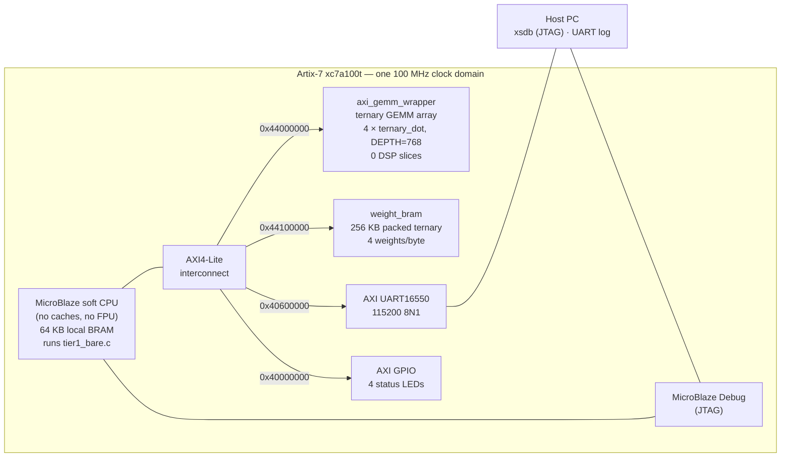
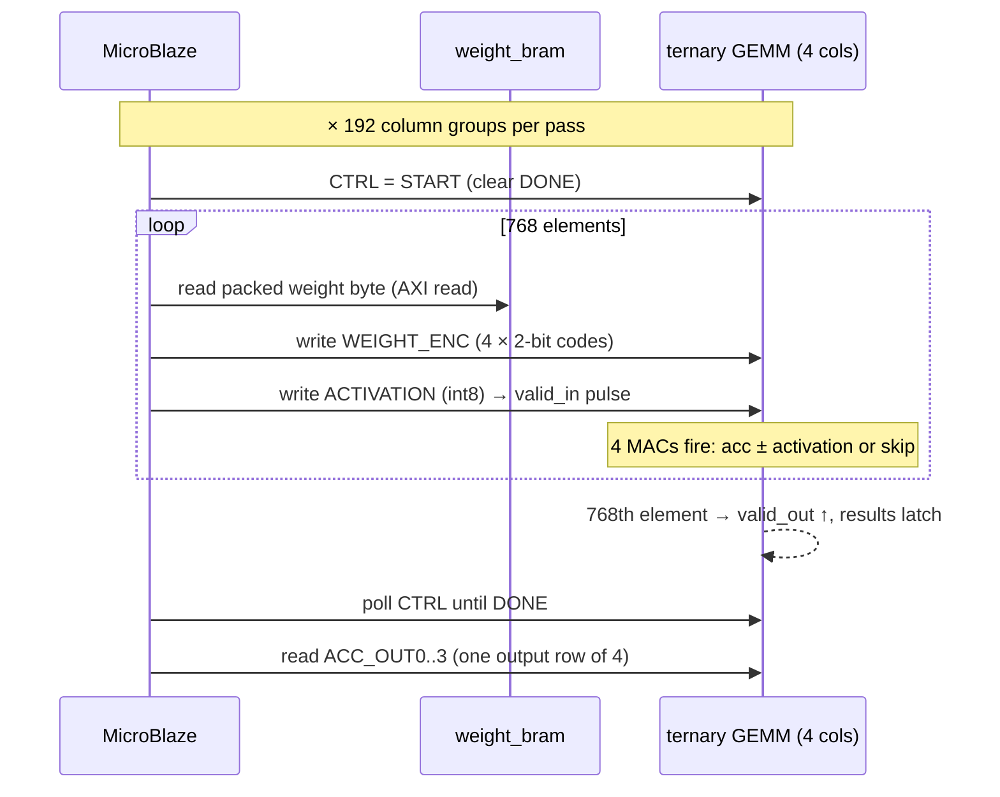

# The Simulator Is Polite. The Silicon Is Not.

**TernaryCore's first real benchmark: a BitNet-shaped ternary GEMM, run with
and without the accelerator on the same chip — and the three bugs that stood
in the way.**

*July 25, 2026 — Arty A7-100T (Artix-7 xc7a100t), Vivado 2025.2*

---

In [the last write-up](article-02.md) we proved a single ternary MAC on real
silicon: one button press, one `(-5) × (-1) + 10 = 15`, one green LED. Nice.
But a single MAC is a party trick. The claim TernaryCore actually makes is
bigger: put a CPU and a ternary accelerator on the *same* fabric, run the
*same* BitNet-shaped workload through both, and let the silicon say which
arithmetic wins.

Today the silicon answered:

```
TernaryCore Tier 1 Benchmark (bare-metal)
Initializing weights (256 KB BRAM)...
Verifying accel vs software (1 pass each)...
Verification PASS
Output checksum: 0xfffff600  out[0..3]=5,0,-5,5

RESULT accel: 5,319,845 cycles/pass   (53.2 ms)
RESULT sw:   19,519,460 cycles/pass  (195.2 ms)
RESULT speedup: 3.67x
```

A 768→768 ternary projection — the shape of a BitNet b1.58 weight layer —
executed 200 times through the accelerator and 10 times in pure C on the
same MicroBlaze, on the same 100 MHz clock, against the same weights, with
element-by-element equivalence checked before a single cycle was counted.

**3.67× is not the headline.** The headline is what the number is made of.
But first, the story of how we got a number at all — because the first run
printed 512 mismatches, every accelerator output read zero, and every one of
our 86 simulation tests was green while it happened.

---

## What we actually put on the Arty

The Tier 1 design (branch `feat/bitnet-accelerator`) is a small
system-on-chip: a computer and its ternary co-processor, sharing one bus on
one Artix-7. This is the full Track A stack from [ROADMAP.md](ROADMAP.md):



The accelerator is deliberately *small* for Tier 1 — four `ternary_dot`
columns, each a chain of the same 81-LUT MAC cell proven in
[article-02](article-02.md). What Tier 1 adds is everything *around* the
math: a CPU that owns the workload, a bus, a memory-mapped register
interface, and a weight store. The GEMM wrapper exposes five registers:

| Offset | Register | Role |
|---|---|---|
| `0x00` | `CTRL` | bit0 start (clears DONE), bit31 DONE (read-only) |
| `0x04` | `ACTIVATION` | write one int8 activation — **each write pulses `valid_in`** |
| `0x08` | `WEIGHT_ENC` | 2-bit ternary codes for the 4 columns |
| `0x10–0x1C` | `ACC_OUT0–3` | int32 column accumulators, latched at vector end |

One forward pass of the 768→768 projection works like this — the CPU
chaperones every element across the bus:



The software baseline is the *same loop with the math done in C*: read the
same packed byte, decode the 2-bit weight, multiply-accumulate in a
register. Same weights, same BRAM, same bus, same CPU — the only variable is
who does the arithmetic. That symmetry is what makes the A/B honest.

Timing closed at 100 MHz with **0 DSP slices** and worst-case slack of
+13.7 ns. The multiplication in this machine is a 2-bit mux deciding add,
subtract, or skip.

## Run 1: all zeros

First flash, first run:

```
MISMATCH col 0: accel=0 sw=5
MISMATCH col 2: accel=0 sw=-5
...
FAIL: 512 output mismatch(es)
```

Every column where the software reference expected ±5, the accelerator said
0. The 256 columns that "passed" were the ones where the answer happened to
be zero. The accelerator was contributing nothing — while 86/86 simulation
tests passed on the same RTL.

What followed was a debugging session conducted entirely over JTAG and UART,
and it peeled back **three separate bugs**, each one a member of a class the
simulator is structurally incapable of catching.

### Bug 1 — the firmware pointed at unmapped memory

`tier1_bench.c` defined the weight BRAM at `0x44010000`. The block design
maps it at `0x44100000`. The firmware address is exactly one byte past the
end of the GEMM wrapper's 64 KB window — unmapped space. Simulation never
noticed because the testbenches drive the RTL directly and never exercise
the block design's address map. *The address map is part of the design. Test
it as one.*

### Bug 2 — valid_out was a level pretending to be a pulse

`ternary_dot` sets `vector_done` on the last element and holds it until the
next vector begins. When a testbench streams elements back-to-back, the next
vector begins one cycle later, and `vector_done` looks exactly like the
one-cycle pulse the documentation promises. When a *CPU* feeds elements over
AXI — tens of idle cycles between writes — `valid_out` stays high across the
whole gap. The wrapper latched results on `valid_out`'s *level*, so it
re-latched every idle cycle; and because the done-flag set had priority over
the CTRL-write clear, `DONE` could never be cleared again. The fix latches
on the rising *edge* (one cycle after it, when the result has settled). The
new regression, `tb_axi_gemm_gaps.v`, drives the wrapper with
MicroBlaze-like 20-cycle gaps — it fails on the old RTL and passes on the
fix. *Your testbench's timing habits are assumptions. Someone else's master
will break them.*

### Bug 3 — multi-driven registers, or: how acc_out became a constant

The deepest one. `ternary_dot.v` reset `acc_out` in its main always block
*and* drove it from a second always block — a leftover from ILA debug
instrumentation. Two drivers for one register. Icarus Verilog shrugs and
simulates something reasonable. Vivado synthesis (`Synth 8-6858`: *"connected
to at least one constant driver which has been preserved, other driver is
ignored"*) resolved the conflict by **tying `acc_out` to zero in silicon**.
Every ACC read, in every bitstream ever built from this RTL, was reading a
constant. The same collision killed `vector_done_delayed`, which quietly
locked the accelerator's accept-condition after its first vector — the
benchmark hang that followed the first two fixes.

Our own [SIMULATION_GUIDE.md](../SIMULATION_GUIDE.md) has a section called
"Simulation ≠ synthesis: the gap that bites everyone." It was written before
this happened. The gap read it and bit anyway. *Treat every CRITICAL WARNING
in a synthesis log as an error until proven cosmetic.*

## Methodology worth stealing

Two constraints shaped the bring-up, and both turned into features:

**No BSP.** Vitis platform generation is a swamp when you're iterating fast,
and the block design had no hardware timer for `XTime` anyway. So the
benchmark firmware (`tier1_bare.c`) is fully bare-metal: its own UART16550
driver, direct register I/O, 23 KB, compiles with one `mb-gcc` line.

**No timer — no problem.** The firmware prints `MARK` lines; a host-side
script timestamps them as they arrive over UART. The fabric clock is exactly
100 MHz, so wall-clock seconds convert to cycles losslessly. Phases run for
seconds; serial latency jitter is microseconds. Free, honest timing.

Isolation between "firmware bug" and "hardware bug" came from `xsdb` pokes:
halt the core, drive a full 768-element vector into the GEMM registers by
hand over JTAG, read back. When a hand-driven vector also returns zeros, you
stop re-reading your C code and start reading synthesis warnings.

## What 3.67× is made of

Per pass, the accelerator path costs 5.32 M cycles. The ternary array's
actual compute — 768 elements × 192 column groups, one element per cycle —
needs only ~147 K of them:

| Where the accelerator pass goes | Cycles | Share |
|---|---|---|
| Ternary array compute (589,824 MACs, 4/cycle) | ~147 K | **~3%** |
| CPU feeding the array over AXI (~442 K bus transactions: 1 read + 2 writes per element, ≈12 cycles each) | ~5.17 M | **~97%** |
| **Total measured** | **5.32 M** | |

**97% of the accelerator's time is the soft CPU hand-feeding it.** The array
sits at ~3% utilization and *still* beats the same CPU doing the math itself
by 3.67×.

That makes this measurement two proofs in one:

1. **The arithmetic works.** Multiplier-free ternary MACs, verified
   element-by-element against software on real silicon, at scale (589,824
   MACs per pass), with 0 DSPs.
2. **The bottleneck is exactly where the roadmap said it was.** The path to
   the [40 GOPS target](ROADMAP.md) is not more math — it's feeding: DMA
   from BRAM/DDR instead of CPU-paced register writes, and widening past 4
   exposed columns. The CPU should orchestrate, not chaperone every byte.

## Stage 1: real BitNet weights, streamed from a PC

The synthetic pattern above proves the datapath. The obvious next question —
does it run *real* BitNet weights? — turned out to be days of firmware, not
weeks, because the RTL doesn't change. We added a tiny UART command protocol
(`LOADW` / `LOADA` / `RUN`) to the firmware and a host script that pulls a
layer from the published `1bitLLM/bitnet_b1_58-large` checkpoint,
absmean-ternarizes it, and streams the packed weights down the wire (147 KB
in ~13 s at 115200 baud). Every run is checked three ways: transfer
checksum, board accelerator vs. board software, and — the new one — board
output vs. an offline NumPy computation of the same layer.

We swept the first transformer block, every weight matrix in it:

| Layer | Source shape | Nonzero after ternarize | Verified vs. reference | Speedup |
|---|---|---|---|---|
| `q_proj` | 1536×1536 | 65.7% | ✅ exact | 3.55× |
| `k_proj` | 1536×1536 | 63.0% | ✅ exact | 3.55× |
| `v_proj` | 1536×1536 | 60.8% | ✅ exact | 3.55× |
| `o_proj` | 1536×1536 | 60.7% | ✅ exact | 3.55× |
| `gate_proj` | 4096×1536 | 65.7% | ✅ exact | 3.56× |
| `down_proj` | 1536×4096 | 66.4% | ✅ exact | 3.55× |

Every layer's hardware output matched the reference model **exactly**,
element for element. The speedup barely moves (3.55–3.56×) — which is exactly
right, and worth dwelling on: the speedup is a property of the *datapath*, not
the *data*, so real weights confirm the number rather than change it. What
changed is the claim. This is no longer "the accelerator agrees with itself
on a synthetic pattern" — it's "the accelerator computes real BitNet b1.58
weight matrices correctly, plumbed end-to-end from a HuggingFace checkpoint,
on a $130 board."

A note on honesty, since this whole piece is about it: a full transformer is
more than its weight-matrix multiplies (attention is activation×activation,
not ternary; norms and softmax are elementwise). What the Arty runs today is
every *ternary weight layer* of a real BitNet block, verified against the
reference — not yet a full forward pass. That distinction is the difference
between this result and a tokens/sec headline, and we'd rather draw it
clearly than blur it.

## Next

- **Tier 2**: DMA weight feed + wider result interface — turn 3% array
  utilization into a headline number.
- **Activation quantization + per-channel scale**: an external contributor
  ([@vlordier](https://github.com/vlordier)) independently arrived with the
  quantizer and rescale RTL — and, remarkably, the *same* fix for the
  multi-driven-register bug above, found with no knowledge of ours. Two
  people, one fix, is the best correctness signal there is.
- **Model-level tokens/sec** belongs on a board whose memory can feed it
  (Zynq / Kria / Alveo U50 — the bandwidth math is in HOST_STREAMING.md).
  The Arty stays what it proved itself to be today: the cleanest possible
  A/B between binary and ternary compute on identical silicon.

The repository is open. The simulator is validated. And now the silicon
agrees with it — for reasons we can defend line by line.

---

*RTL, firmware, testbenches, and the debug trail are on the
[`feat/bitnet-accelerator`](https://github.com/Ternarycore/ternarycore/tree/feat/bitnet-accelerator)
branch. Fixes landed in `82e4948` (edge-detect latch) and `8336bc7`
(multi-driven registers); the gap-injection regression is
`tb/tb_axi_gemm_gaps.v`.*
